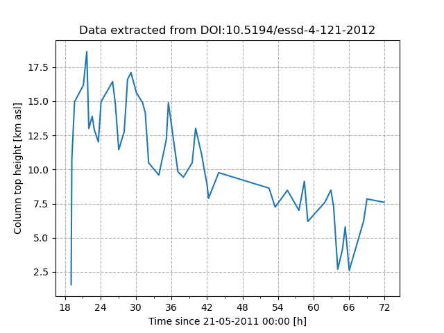
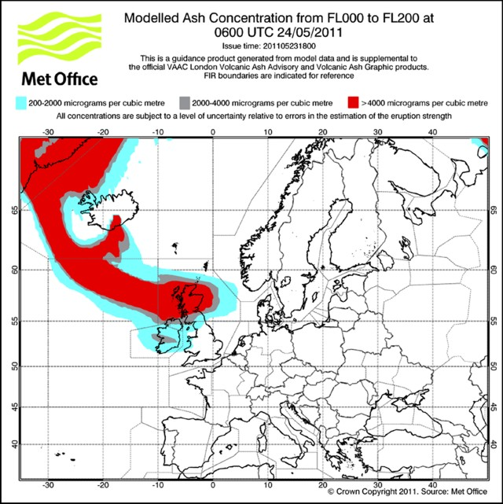
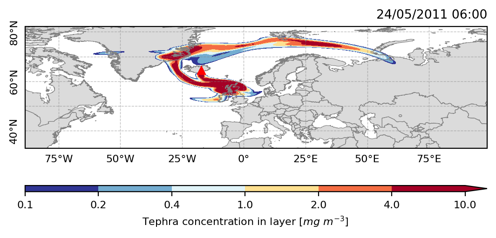
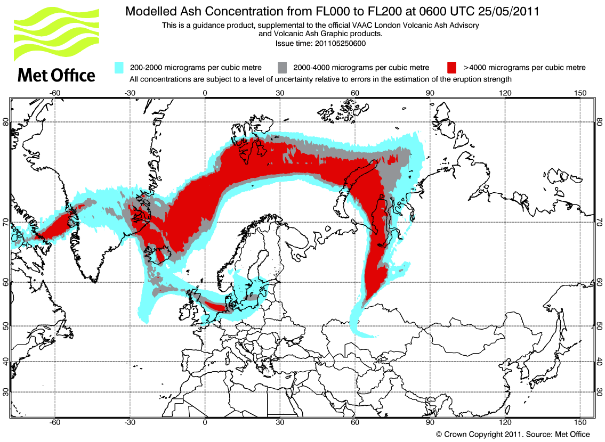
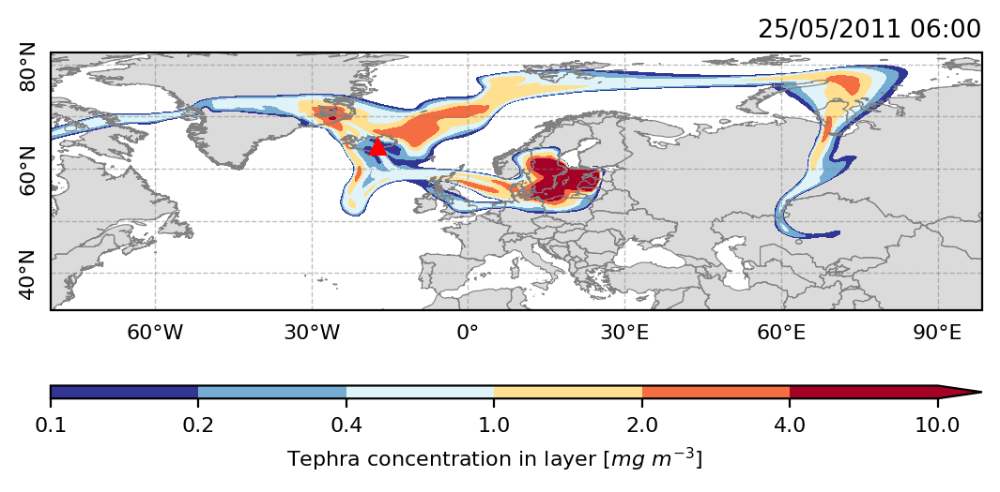

# Simulation of the 2011 eruption of Grímsvötn

## Model configuration
A 100-h simulation was performed using FALL3D driven by ERA5 data (pressure
levels). Model configuration is defined in the `grimsvotn2011.inp` input file.

## Eruptive phases

Column top heights extracted from [Petersen et al. (2012)](https://doi.org/10.5194/essd-4-121-2012)

## Tephra column mass

## Averaged tephra concentration (FL000-FL200)

## Comparisons with Met Office forecasts

| NAME     | FALL3D  |
| -------- | ------- |
|  |  |
|  |  |

## References

Petersen, G. N., Bjornsson, H., Arason, P., and von Löwis, S.: Two weather radar time series of the altitude of the volcanic plume during the May 2011 eruption of Grímsvötn, Iceland, Earth Syst. Sci. Data, 4, 121–127, https://doi.org/10.5194/essd-4-121-2012, 2012.

